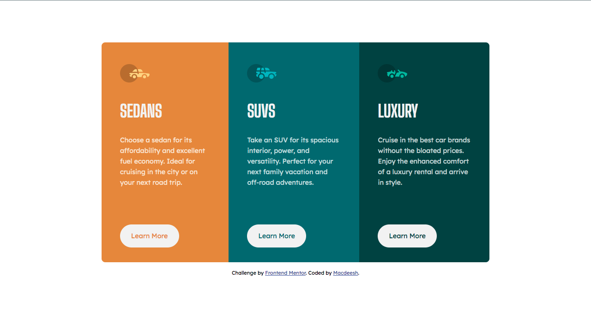

# Frontend Mentor - 3 Columns preview card component challenge

This is a solution to the [3-column preview card component](https://www.frontendmentor.io/challenges/3column-preview-card-component-pH92eAR2-). 

## Links

- Solution URL: [https://github.com/macdeesh/Columns-preview-card-component]
- Live Site URL: [https://macdeesh.github.io/Columns-preview-card-component/]

## Screenshot




## What I learned

- I tried to make the borders of the card container rounded with ```border-radius``` but for some reason it didn't work, so I added :
- ```overflow: hidden;```


- To add an obvious focus style to the interactive element, in this case a button, I used ```:focus-visible```  and changed the default styling for keyboard users :


 ```css
 main a:focus-visible {
  outline: none;
  font-size: 1rem;
  background-color: inherit;
  border: 2px solid hsl(0, 0%, 95%);
  color: hsl(0, 0%, 95%);
  box-shadow: 1px 1px 5px rgba(1, 1, 0, .7);
 }
   ```
   
## Author

 - Github - [Macdeesh](https://github.com/macdeesh)
 - Twitter - [@Macdiish](https://twitter.com/Macdiish)
